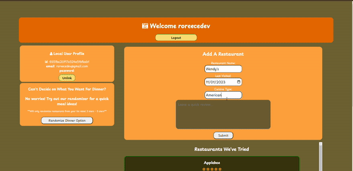

# What's For Dinner Babe?

Welcome to What's For Dinner Babe?, a delightful CRUD application built with Node.js, JavaScript, EJS, HTML, and CSS/Bootstrap. This web application simplifies the decision-making process around dinner by allowing users to manage their favorite restaurants, rate them, and even includes a nifty randomizer for those moments of indecision.

## Project Overview

Are you tired of the eternal question of what's for dinner? Look no further! What's For Dinner Babe? is a restaurant rating and review app designed to streamline the decision-making process. Users can log their favorite restaurants, provide star ratings, and update their entries as their dining preferences evolve.

**Link to project:** 

**Screenshot:**

## How It's Made

**Tech used:** Node.js, JavaScript, EJS, HTML, CSS/Bootstrap

In the development of What's For Dinner Babe?, Node.js serves as the backend powerhouse, handling the CRUD operations seamlessly. JavaScript, both on the frontend and backend, adds the necessary interactivity and functionality to the application. EJS templates facilitate dynamic content rendering, creating a responsive and engaging user interface.

The frontend is styled using a combination of HTML and CSS, with Bootstrap providing a solid foundation for a visually appealing and mobile-friendly design. The use of CSS and Bootstrap ensures a sleek and consistent look throughout the application.

## Optimizations

*No optimizations at the moment.*

## Lessons Learned

Building a CRUD application with Node.js, JavaScript, EJS, and Bootstrap has been an enlightening experience. One key takeaway is the efficiency and versatility of Node.js in handling server-side operations. The integration of EJS templates allows for dynamic content generation, enhancing the user experience.

The utilization of Bootstrap significantly expedites the frontend development process, providing a responsive design without sacrificing aesthetic appeal. The application's CRUD functionality underscores the importance of maintaining data integrity and providing users with a seamless means of managing their preferences.

As with any project, continuous learning remains a focal point. This journey has reinforced the value of a well-structured backend and the importance of responsive design in creating a user-friendly experience.

## Installation

1. Clone repo
2. run `npm install`

## Usage

1. run `node server.js`
2. Navigate to `localhost:8080`

